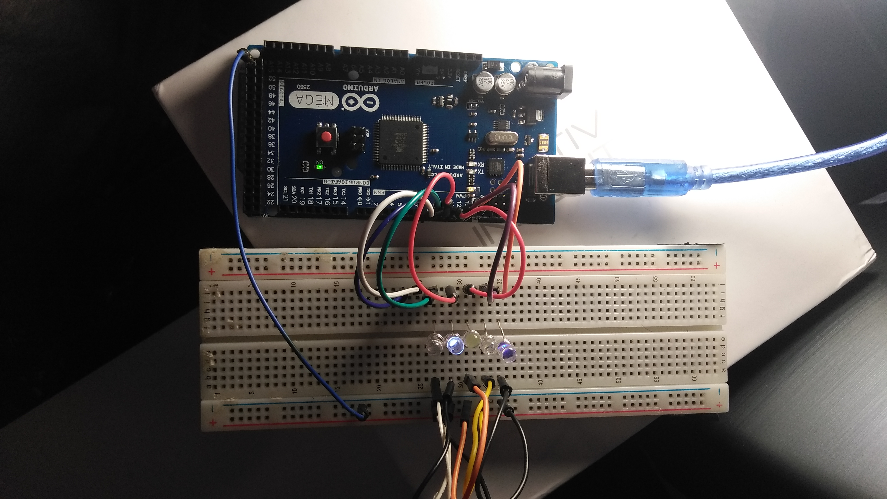
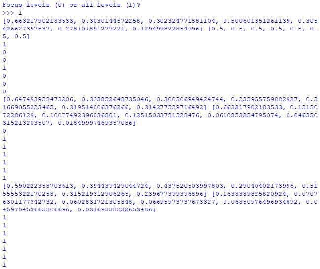

# Emotiv-x-Arduino
Communicates synaptic data from the Emotiv INSIGHT EEG to an Arduino Mega ADK, visualizes Performance Metrics as LEDs.

## Summary
A communicator from the Emotiv INSIGHT EEG to the Arduino Mega ADK. Utilizes Python, JSON-RPC, and C++ to send binary data based off of the increase or decrease of a subject's physiological arousal levels, synaptic wave morphology and synaptic wave frequency through a serial port to turn on a series of LEDs.

